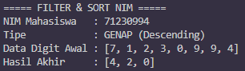
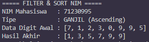

# PRAKTIKUM ALGORITMA DAN STRUKTUR DATA

**Topik:** Analisis Algoritma Dan Fungsi Rekursif

Praktikum ini bertujuan untuk menguji pemahaman Anda tentang fungsi rekursif, cara kerja memori saat fungsi memanggil dirinya sendiri, dan cara memodifikasi data array tanpa menggunakan perulangan biasa.

---

## Deskripsi Tugas

Anda ditugaskan membuat program untuk menyaring (*filtering*) dan mengurutkan (*sorting*) angka-angka yang diambil dari Nomor Induk Mahasiswa (NIM) Anda. Syarat penyaringan dan arah pengurutan ditentukan oleh apakah digit terakhir NIM Anda merupakan angka ganjil atau genap.

## Ketentuan dan Aturan Pengerjaan

*   **Aturan Berdasarkan NIM:**
    *   Jika digit terakhir NIM **GANJIL**: Ambil HANYA angka ganjil dari array, lalu urutkan dari yang terkecil ke terbesar (**Ascending**).
    *   Jika digit terakhir NIM **GENAP**: Ambil HANYA angka genap dari array, lalu urutkan dari yang terbesar ke terkecil (**Descending**).
*   **Wajib Rekursif Murni:** Seluruh proses pencarian data, penyaringan, dan pengurutan HANYA boleh menggunakan fungsi rekursif. DILARANG KERAS menggunakan perulangan seperti `for` atau `while`.
*   **Dilarang Menggunakan Fungsi Bawaan:** Anda dilarang menggunakan fungsi bawaan dari bahasa pemrograman untuk memproses array seperti `sort()`, `sorted()`, `min()`, `max()`, `filter()`, atau fungsi bantuan lainnya.
*   **Jangan Mengubah Kode Utama:** Kerjakan tugas Anda HANYA pada baris kode yang memiliki komentar `TODO`. 

---

## Arsitektur Fungsi

Program ini terdiri dari dua fungsi rekursif. Berikut adalah penjelasan tentang apa yang harus dilakukan oleh masing-masing fungsi:

### 1. `InsertRecursive(sorted_array, current_value, current_length)`
Fungsi ini bertugas menyisipkan satu angka baru ke dalam array yang kondisinya sudah dalam keadaan terurut.
*   **Parameter:**
    *   `sorted_array`: Array yang sudah terurut.
    *   `current_value`: Angka baru yang akan dimasukkan ke dalam array.
    *   `current_length`: Batas panjang array yang sedang dicek pada tahap rekursi ini.
*   **Tujuan Fungsi:** Mengecek isi array dari belakang untuk mencari posisi yang pas agar angka baru bisa masuk tanpa merusak urutan, lalu menggabungkannya ke posisi tersebut.
*   **Hasil Akhir:** Sebuah array baru yang ukurannya bertambah satu angka dan tetap terurut.

### 2. `RecursiveFilterSort(data_array, current_length)`
Fungsi ini bertugas memecah array awal, memeriksa angkanya satu per satu, lalu menyaringnya sebelum dikirim ke fungsi pengurutan.
*   **Parameter:**
    *   `data_array`: Array awal yang berisi kumpulan digit angka NIM.
    *   `current_length`: Posisi panjang data yang sedang diproses.
*   **Tujuan Fungsi:** Membongkar array sampai mencapai kondisi berhenti (*base case*). Setelah itu, fungsi akan mengecek apakah angka yang sedang diproses sesuai dengan aturan NIM (ganjil/genap). Jika sesuai, angka tersebut akan dikirim ke fungsi `InsertRecursive`. Jika tidak sesuai, abaikan angkanya dan lanjutkan proses tanpa mengubah isi array.
*   **Hasil Akhir:** Array berisi kumpulan angka yang sudah disaring dan diurutkan.

---

## Instruksi Pengerjaan (TODO)

Anda diwajibkan melengkapi kode pada 4 bagian `TODO` berikut ini:

1.  **TODO 1 (Syarat Pengurutan):** Buat kondisi berhenti (*base case*) dan tulis logika perbandingan (seperti lebih besar atau lebih kecil) sesuai aturan NIM Anda untuk menentukan urutan angka.
2.  **TODO 2 (Pemanggilan Rekursif):** Buat perintah pemanggilan rekursif untuk terus mencari posisi angka yang pas, serta gabungkan kembali potongan array agar datanya tidak hilang.
3.  **TODO 3 (Syarat Penyaringan):** Buat logika pengecekan nilai (`IF`). Jika angka memenuhi syarat NIM Anda, panggil fungsi `InsertRecursive`. Jika angkanya tidak memenuhi syarat, lewati saja dan kembalikan array sebelumnya apa adanya.
4.  **TODO 4 (Menampilkan Output):** Buat kode untuk mengecek apakah digit terakhir NIM Anda ganjil atau genap, kemudian tampilkan hasil akhir program ke layar sesuai dengan format yang telah ditentukan.

---

## Contoh Format Keluaran

Pastikan tampilan program Anda persis menyerupai contoh di bawah ini.

**Contoh 1: Output jika NIM diakhiri angka Genap (Descending)**  

**Contoh 2: Output jika NIM diakhiri angka Ganjil (Ascending)**  
