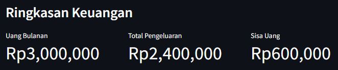

# UG Streamlit - Pengeluaran Anak Kos

## Deskripsi

Kamu adalah seorang mahasiswa yang tinggal di kos.

Setiap bulan kamu mendapatkan uang bulanan dari orang tua, tetapi kamu merasa uang tersebut sering habis sebelum akhir bulan. Setelah diperhatikan, ternyata banyak pengeluaran kecil yang tidak terasa jika dilakukan satu per satu.

Karena itu, kamu ingin membuat sebuah program sederhana menggunakan **Streamlit** untuk membantu menghitung dan menganalisis pengeluaran bulanan.

Program harus dapat menerima jumlah uang bulanan dan pengeluaran berdasarkan beberapa kategori, kemudian menghitung total pengeluaran, sisa uang, serta menampilkan grafik pengeluaran.

---

# 📢 Ketentuan

Buat program Streamlit dengan judul:

> **🏠 Pengeluaran Anak Kos [NIM Anda]**

Program harus menerima input:

### 1. Uang Bulanan

Jumlah uang bulanan.

---

### 2. Pengeluaran Makanan

Jumlah uang yang digunakan untuk makanan selama sebulan.

---

### 3. Pengeluaran Kos

Jumlah uang yang digunakan untuk membayar kos.

---

### 4. Pengeluaran Transportasi

Jumlah uang yang digunakan untuk transportasi.

---

### 5. Pengeluaran Internet/Pulsa

Jumlah uang yang digunakan untuk internet atau pulsa.

---

### 6. Pengeluaran Hiburan

Jumlah uang yang digunakan untuk hiburan.

---

# Perhitungan

Program harus menghitung **total pengeluaran**.
Kemudian hitung **sisa uang**:



---

# Kondisi Keuangan

Kondisi keuangan ditentukan berdasarkan sisa uang.

### Kondisi 1 – Masih Aman

Jika:

```text
Sisa Uang > 0
```

Tampilkan pesan `st.success()`:

```text
Keuanganmu masih aman bulan ini!
```

---

### Kondisi 2 – Uang Habis

Jika:

```text
Sisa Uang = 0
```

Tampilkan pesan `st.warning()`:

```text
Uangmu habis..
```

---

### Kondisi 3 – Pengeluaran Berlebihan

Jika:

```text
Sisa Uang < 0
```

Tampilkan pesan `st.error()`:

```text
Pengeluaranmu melebihi uang bulanan!
```

---

# Pengeluaran Terbesar

Contoh:

```text
Pengeluaran terbesar kamu adalah:

Makanan
Rp1.200.000
```

_Clue:_ Gunakan **percabangan** untuk membandingkan kelima kategori pengeluaran, dan **list** untuk menampung pengeluaran terbesar.

---

# Grafik Pengeluaran

Program harus menampilkan grafik yang membandingkan pengeluaran berdasarkan kategori:

```text
Makanan
Kos
Transportasi
Internet/Pulsa
Hiburan
```

Gunakan komponen **bar chart** Streamlit.

Grafik harus menunjukkan jumlah uang yang dikeluarkan untuk setiap kategori.

---

# Library

Library yang diperlukan:

```text
streamlit
pandas
```

**Biar ga error**, install dulu:

```bash
pip install streamlit pandas
```

---

# Kriteria Penilaian

| Komponen                        |    Bobot |
| ------------------------------- | -------: |
| Input menggunakan Streamlit     |      20% |
| Perhitungan total & sisa uang   |      30% |
| Percabangan kondisi keuangan    |      15% |
| Menentukan pengeluaran terbesar |      20% |
| Grafik pengeluaran              |      15% |
| **Total**                       | **100%** |
